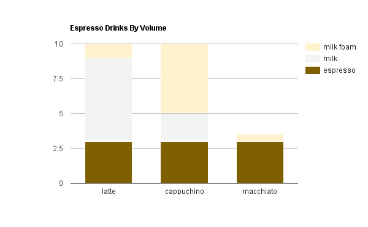

Proj 3 CUDA Path Tracer - Instructions
========================

This is due **Sunday October 9** at midnight.

**Summary:**
In this project, you'll implement a CUDA-based path tracer capable of rendering
globally-illuminated images very quickly.
Since in this class we are concerned with working in GPU programming,
performance, and the generation of actual beautiful images (and not with
mundane programming tasks like I/O), this project includes base code for
loading a scene description file, described below, and various other things
that generally make up a framework for previewing and saving images.

The core renderer is left for you to implement. Finally, note that, while this
base code is meant to serve as a strong starting point for a CUDA path tracer,
you are not required to use it if you don't want to. You may also change any
part of the base code as you please. **This is YOUR project.**

**Recommendation:** Every image you save should automatically get a different
filename. Don't delete all of them! For the benefit of your README, keep a
bunch of them around so you can pick a few to document your progress at the
end. Outtakes are highly appreciated!

### Contents

* `src/` C++/CUDA source files.
* `scenes/` Example scene description files.
* `img/` Renders of example scene description files.
  (These probably won't match precisely with yours.)
* `external/` Includes and static libraries for 3rd party libraries.


### Running the code

The main function requires a scene description file. Call the program with
one as an argument: `cis565_path_tracer scenes/sphere.txt`.
(In Visual Studio, `../scenes/sphere.txt`.)

If you are using Visual Studio, you can set this in the Debugging > Command
Arguments section in the Project properties. Make sure you get the path right -
read the console for errors.

#### Controls

* Esc to save an image and exit.
* S to save an image. Watch the console for the output filename.
* Space to re-center the camera at the original scene lookAt point
* left mouse button to rotate the camera
* right mouse button on the vertical axis to zoom in/out
* middle mouse button to move the LOOKAT point in the scene's X/Z plane

## Requirements

**Ask in the google group for clarifications.**

In this project, you are given code for:

* Loading and reading the scene description format
* Sphere and box intersection functions
* Support for saving images
* Working CUDA-GL interop for previewing your render while it's running
* A skeleton renderer with:
  * Naive ray-scene intersection
  * A "fake" shading kernel that colors rays based on the material and intersection properties
  but does NOT compute a new ray based on the BSDF

##### Part 1 - Core Features

You will need to implement the following features:
* A shading kernel with BSDF evaluation for:
  * Ideal Diffuse surfaces (using provided cosine-weighted scatter function, see below.) [PBRT 8.3].
  * Perfectly specular-reflective (mirrored) surfaces (e.g. using `glm::reflect`).
  * See notes on diffuse/specular in `scatterRay` and on imperfect specular below.
* Path continuation/termination using Stream Compaction
* After you have a [basic pathtracer up and running](img/REFERENCE_cornell.5000samp.png),
implement a means of making rays/pathSegments/intersections contiguous in memory
by material type. This should be easily toggleable.
  * Consider the problems with coloring every path segment in a buffer and performing
  BSDF evaluation using one big shading kernel:
  different materials/BSDF evaluations within the kernel will take different
  amounts of time to complete.
  * Sort the rays/path segments so that rays/paths interacting with the same material
  are contiguous in memory before shading. How does this impact performance? Why?
* A toggleable option to cache the first bounce intersections for re-use across all
subsequent iterations. Provide performance benefit analysis across different
max ray depths.

##### Part 2 - Make Your Pathtracer Unique!

You are required to choose and implement at least 2 of the following features.
If you find other good references for these features, share them!
**Extra credit**: implement more features on top of the 2 required ones,
with point value up to +20/100 at the grader's discretion
(based on difficulty and coolness).

* Work-efficient stream compaction using shared memory across
  multiple blocks. (See
  [*GPU Gems 3*, Chapter 39](http://http.developer.nvidia.com/GPUGems3/gpugems3_ch39.html).)
  Note that this is not an option if you implemented shared memory stream
  compaction as extra credit for Project 2.
* 2 of these 3 smaller features:
  * Refraction (e.g. glass/water) [PBRT 8.2] with Frensel effects using
    [Schlick's approximation](https://en.wikipedia.org/wiki/Schlick's_approximation)
    or more accurate methods [PBRT 8.5]. You can use `glm::refract` for
    Snell's law.
    * Recommended but not required: non-perfect specular surfaces. (See below.)
  * Physically-based depth-of-field (by jittering rays within an aperture)
    [PBRT 6.2.3].
  * Stochastic Sampled Antialiasing. See Paul Bourke's [notes](http://paulbourke.net/miscellaneous/aliasing/).
  Keep in mind how this influences the first-bounce cache in part 1.
* Texture mapping [PBRT 10.4] and Bump mapping [PBRT 9.3].
  * Implement file-loaded textures AND a basic procedural texture
  * Provide a performance comparison between the two
* Direct lighting (by taking a final ray directly to a random point on an
  emissive object acting as a light source). Or more advanced [PBRT 15.1.1].
* Some method of defining object motion, and motion blur by averaging samples
  at different times in the animation.
* Subsurface scattering [PBRT 5.6.2, 11.6].
* [Better hemisphere sampling methods](http://graphics.ucsd.edu/courses/cse168_s14/ucsd/CSE168_11_Random.pdf)
* Arbitrary mesh loading and rendering (e.g. `obj` files) with
toggleable bounding volume intersection culling
  * You can find models online or export them from your favorite 3D modeling application.
  With approval, you may use a third-party loading code to bring the data
  into C++. [tinyObj](http://syoyo.github.io/tinyobjloader/) is highly recommended.
  * You can use the triangle intersection function `glm::intersectRayTriangle`.
  * bounding volume intersection culling: reduce the number of rays that have to
  be checked against the entire mesh by first checking rays against a volume
  that completely bounds the mesh. For full credit, provide performance analysis
  with and without this optimization.
* Hierarchical spatial datastructures - for better ray/scene intersection testing
  * Octree recommended - this feature is more about traversal on the GPU than perfect tree structure
  * CPU-side datastructure construction is sufficient - GPU-side construction was
  a [final project.](https://github.com/jeremynewlin/Accel)
  * Make sure this is toggleable for performance comparisons
  * If implemented in conjunction with Arbitrary mesh loading, this qualifies as the
toggleable bounding volume intersection culling.
  * See below for more resources
* [Waverfont pathtracing](https://research.nvidia.com/publication/megakernels-considered-harmful-wavefront-path-tracing-gpus):
Group rays by material without a  sorting pass. A sane implementation will
require considerable refactoring, since every supported material suddenly needs
its own kernel.

This 'extra features' list is not comprehensive. If you have a particular idea
you would like to implement (e.g. acceleration structures, etc.), please
contact us first.

For each extra feature, you must provide the following analysis:

* Overview write-up of the feature
* Performance impact of the feature
* If you did something to accelerate the feature, what did you do and why?
* Compare your GPU version of the feature to a HYPOTHETICAL CPU version
  (you don't have to implement it!) Does it benefit or suffer from being
  implemented on the GPU?
* How might this feature be optimized beyond your current implementation?

## Base Code Tour

You'll be working in the following files. Look for important parts of the code:
search for `CHECKITOUT`. You'll have to implement parts labeled with `TODO`.
(But don't let these constrain you - you have free rein!)

* `src/pathtrace.cu`: path tracing kernels, device functions, and calling code
  * `pathtraceInit` initializes the path tracer state - it should copy
    scene data (e.g. geometry, materials) from `Scene`.
  * `pathtraceFree` frees memory allocated by `pathtraceInit`
  * `pathtrace` performs one iteration of the rendering - it handles kernel
    launches, memory copies, transferring some data, etc.
    * See comments for a low-level path tracing recap.
* `src/intersections.h`: ray intersection functions
  * `boxIntersectionTest` and `sphereIntersectionTest`, which take in a ray and
    a geometry object and return various properties of the intersection.
* `src/interactions.h`: ray scattering functions
  * `calculateRandomDirectionInHemisphere`: a cosine-weighted random direction
    in a hemisphere. Needed for implementing diffuse surfaces.
  * `scatterRay`: this function should perform all ray scattering, and will
    call `calculateRandomDirectionInHemisphere`. See comments for details.
* `src/main.cpp`: you don't need to do anything here, but you can change the
  program to save `.hdr` image files, if you want (for postprocessing).

### Generating random numbers

```
thrust::default_random_engine rng(hash(index));
thrust::uniform_real_distribution<float> u01(0, 1);
float result = u01(rng);
```

There is a convenience function for generating a random engine using a
combination of index, iteration, and depth as the seed:

```
thrust::default_random_engine rng = random_engine(iter, index, depth);
```

### Imperfect specular lighting

In path tracing, like diffuse materials, specular materials are
simulated using a probability distribution instead computing the
strength of a ray bounce based on angles.

Equations 7, 8, and 9 of
[*GPU Gems 3*, Chapter 20](http://http.developer.nvidia.com/GPUGems3/gpugems3_ch20.html)
give the formulas for generating a random specular ray. (Note that
there is a typographical error: χ in the text = ξ in the formulas.)

Also see the notes in `scatterRay` for probability splits between
diffuse/specular/other material types.

See also: PBRT 8.2.2.

### Hierarchical spatial datastructures

One method for avoiding checking a ray against every primitive in the scene or
every triangle in a mesh is to bin the primitives in a hierarchical spatial
datastructure such as an [octree](https://en.wikipedia.org/wiki/Octree).
Ray-primitive intersection then involves recursively testing the ray against
bounding volumes at different levels in the tree until a leaf containing a
subset of primitives/triangles is reached, at which point the ray is checked
against all the primitives/triangles in the leaf.

* We highly recommend building the datastructure on the CPU and encapsulating
the tree buffers into their own struct, with its own dedicated GPU memory
management functions.
* We highly recommend working through your tree construction algorithm by hand
with a couple cases before writing any actual code.
  * How does the algorithm distribute triangles uniformly distributed in space?
  * What if the model is a perfect axis-aligned cube with 12 triangles in 6 faces?
  This test can often bring up numerous edge cases!
* Note that traversal on the GPU must be coded iteratively!
* Good execution on the GPU requires tuning the maximum tree depth. Make this
configurable from the start.
* If a primitive spans more than one leaf cell in the datastructure, it is
sufficient for this project to count the primitive in each leaf cell.

### Handling Long-Running CUDA Threads

By default, your GPU driver will probably kill a CUDA kernel if it runs for more than 5 seconds. There's a way to disable this timeout. Just beware of infinite loops - they may lock up your computer.

> The easiest way to disable TDR for Cuda programming, assuming you have the NVIDIA Nsight tools installed, is to open the Nsight Monitor, click on "Nsight Monitor options", and under "General" set "WDDM TDR enabled" to false. This will change the registry setting for you. Close and reboot. Any change to the TDR registry setting won't take effect until you reboot. [Stack Overflow](http://stackoverflow.com/questions/497685/cuda-apps-time-out-fail-after-several-seconds-how-to-work-around-this)

### Notes on GLM

This project uses GLM for linear algebra.

On NVIDIA cards pre-Fermi (pre-DX12), you may have issues with mat4-vec4
multiplication. If you have one of these cards, be careful! If you have issues,
you might need to grab `cudamat4` and `multiplyMV` from the
[Fall 2014 project](https://github.com/CIS565-Fall-2014/Project3-Pathtracer).
Let us know if you need to do this.

### Scene File Format

This project uses a custom scene description format. Scene files are flat text
files that describe all geometry, materials, lights, cameras, and render
settings inside of the scene. Items in the format are delimited by new lines,
and comments can be added using C-style `// comments`.

Materials are defined in the following fashion:

* MATERIAL (material ID) //material header
* RGB (float r) (float g) (float b) //diffuse color
* SPECX (float specx) //specular exponent
* SPECRGB (float r) (float g) (float b) //specular color
* REFL (bool refl) //reflectivity flag, 0 for no, 1 for yes
* REFR (bool refr) //refractivity flag, 0 for no, 1 for yes
* REFRIOR (float ior) //index of refraction for Fresnel effects
* EMITTANCE (float emittance) //the emittance strength of the material. Material is a light source iff emittance > 0.

Cameras are defined in the following fashion:

* CAMERA //camera header
* RES (float x) (float y) //resolution
* FOVY (float fovy) //vertical field of view half-angle. the horizonal angle is calculated from this and the reslution
* ITERATIONS (float interations) //how many iterations to refine the image
* DEPTH (int depth) //maximum depth (number of times the path will bounce)
* FILE (string filename) //file to output render to upon completion
* EYE (float x) (float y) (float z) //camera's position in worldspace
* LOOKAT (float x) (float y) (float z) //point in space that the camera orbits around and points at
* UP (float x) (float y) (float z) //camera's up vector

Objects are defined in the following fashion:

* OBJECT (object ID) //object header
* (cube OR sphere OR mesh) //type of object, can be either "cube", "sphere", or
  "mesh". Note that cubes and spheres are unit sized and centered at the
  origin.
* material (material ID) //material to assign this object
* TRANS (float transx) (float transy) (float transz) //translation
* ROTAT (float rotationx) (float rotationy) (float rotationz) //rotation
* SCALE (float scalex) (float scaley) (float scalez) //scale

Two examples are provided in the `scenes/` directory: a single emissive sphere,
and a simple cornell box made using cubes for walls and lights and a sphere in
the middle.

## Third-Party Code Policy

* Use of any third-party code must be approved by asking on our Google Group.
* If it is approved, all students are welcome to use it. Generally, we approve
  use of third-party code that is not a core part of the project. For example,
  for the path tracer, we would approve using a third-party library for loading
  models, but would not approve copying and pasting a CUDA function for doing
  refraction.
* Third-party code **MUST** be credited in README.md.
* Using third-party code without its approval, including using another
  student's code, is an academic integrity violation, and will, at minimum,
  result in you receiving an F for the semester.

## README

Please see: [**TIPS FOR WRITING AN AWESOME README**](https://github.com/pjcozzi/Articles/blob/master/CIS565/GitHubRepo/README.md)

* Sell your project.
* Assume the reader has a little knowledge of path tracing - don't go into
  detail explaining what it is. Focus on your project.
* Don't talk about it like it's an assignment - don't say what is and isn't
  "extra" or "extra credit." Talk about what you accomplished.
* Use this to document what you've done.
* *DO NOT* leave the README to the last minute! It is a crucial part of the
  project, and we will not be able to grade you without a good README.

In addition:

* This is a renderer, so include images that you've made!
* Be sure to back your claims for optimization with numbers and comparisons.
* If you reference any other material, please provide a link to it.
* You wil not be graded on how fast your path tracer runs, but getting close to
  real-time is always nice!
* If you have a fast GPU renderer, it is very good to show case this with a
  video to show interactivity. If you do so, please include a link!

### Analysis

* Stream compaction helps most after a few bounces. Print and plot the
  effects of stream compaction within a single iteration (i.e. the number of
  unterminated rays after each bounce) and evaluate the benefits you get from
  stream compaction.
* Compare scenes which are open (like the given cornell box) and closed
  (i.e. no light can escape the scene). Again, compare the performance effects
  of stream compaction! Remember, stream compaction only affects rays which
  terminate, so what might you expect?
* For optimizations that target specific kernels, we recommend using
  stacked bar graphs to convey total execution time and improvements in
  individual kernels. For example:

  

  Timings from NSight should be very useful for generating these kinds of charts.

## Submit

If you have modified any of the `CMakeLists.txt` files at all (aside from the
list of `SOURCE_FILES`), mentions it explicity.
Beware of any build issues discussed on the Google Group.

Open a GitHub pull request so that we can see that you have finished.
The title should be "Project 3: YOUR NAME".
The template of the comment section of your pull request is attached below, you can do some copy and paste:  

* [Repo Link](https://link-to-your-repo)
* `Your PENNKEY`
* (Briefly) Mentions features that you've completed. Especially those bells and whistles you want to highlight
    * Feature 0
    * Feature 1
    * ...
* Feedback on the project itself, if any.

## References

* [PBRT] Physically Based Rendering, Second Edition: From Theory To Implementation. Pharr, Matt and Humphreys, Greg. 2010.
* Antialiasing and Raytracing. Chris Cooksey and Paul Bourke, http://paulbourke.net/miscellaneous/aliasing/
* [Sampling notes](http://graphics.ucsd.edu/courses/cse168_s14/) from Steve Rotenberg and Matteo Mannino, University of California, San Diego, CSE168: Rendering Algorithms
