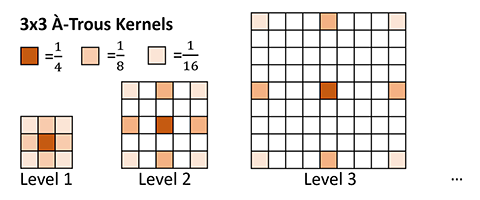
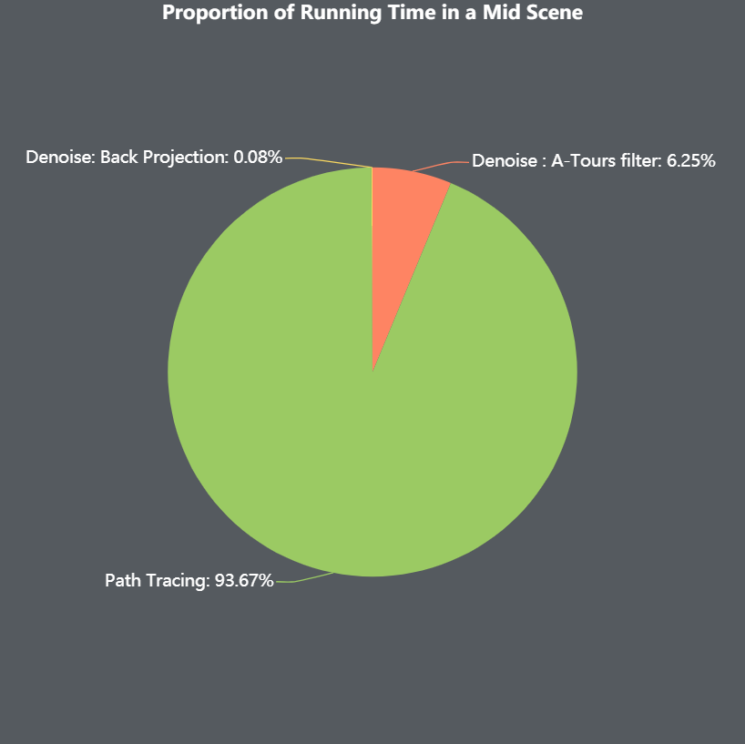
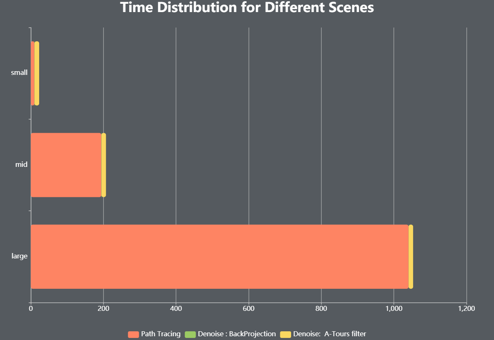
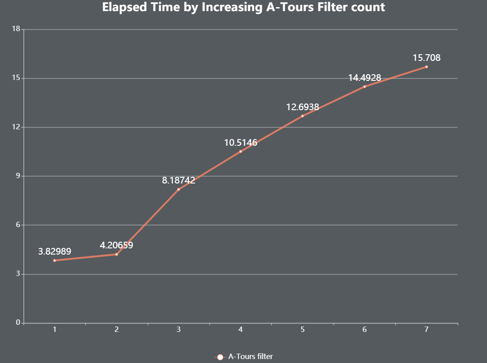
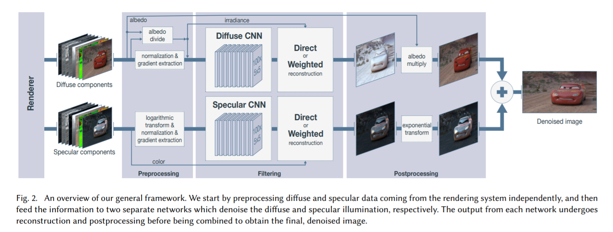
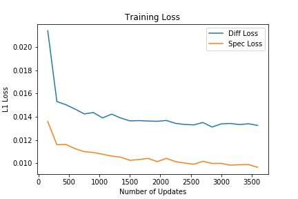
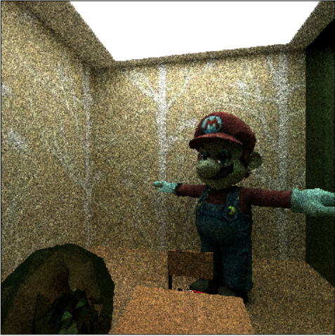
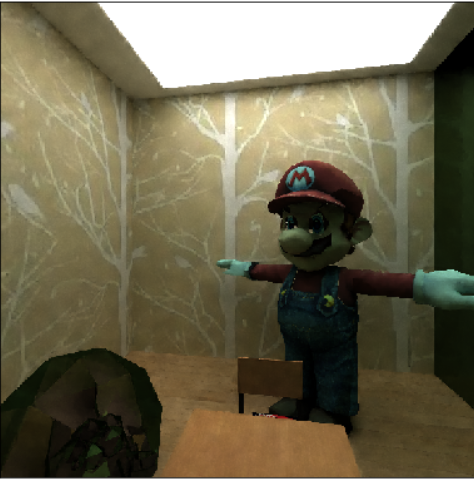

Path Tracing Denoising
================
CIS 565: *GPU Programming and Architecture* Final Project
 - **Zheyuan Xie** [[GitHub](https://github.com/ZheyuanXie)] [[LinkedIn](https://www.linkedin.com/in/zheyuan-xie)]
 - **Yan Dong** [[GitHub](https://github.com/coffeiersama)] [[LinkedIn](https://www.linkedin.com/in/yan-dong-572b1113b)]
- **Weiqi Chen** [[GitHub](https://github.com/WaikeiChan)] [[LinkedIn](https://www.linkedin.com/in/weiqi-ricky-chen-2b04b2ab)]


This is the final project for CIS 565: GPU Programming. The goal of the project is to denoise Monte-Carlo path traced images with low sample counts. We attempted two methods:

 - Spatiotemporal (Spatiotemporal Variance Guided Filtering)
 - Machine Learning (Kernel Predicting Convolutional Networks)

## Overview

Physically based monte-carlo path tracing can produce photo-realistc rendering of computer graphics scenes. However, even with today's hardware it is impossible to converge a scene quickly and meet the performance requirement for real-time interactive application such as games. To bring path tracing to real-time, we reduce sample counts per pixel to 1 and apply post-processing to eliminate noise.

*Signal processing* and *Accumulation* are two major techniques of denosing. Signal processing techniques blur out noise by applying spatial filters or machine learning to the output; Accumulation techniques make it possible to reuse samples in a moving scene by associating pixel between frames. *Spatio-Temporal Variance Guided Filter* [Schied 2017] combines these two techniques and enables high quaility real-time path tracing for dynamic scenes. 

## Demo


## Path Tracing
The project is developed based on [CIS 565 Project 3](https://github.com/ZheyuanXie/Project3-CUDA-Path-Tracer). Addtion to the project 3, we implemented texture mapping and bounding volume hierarchy to accelerate path tracing for complex meshes. To reduce sample variance, if the ray hit matte surface, we trace a shadow ray directly to the light.

## Denoising - Spatiotemporal Method


### Temporal Accumulation
To reuse samples from the previous frame, we reproject each pixel sample to its prior frame and calculate its screen space coordinate. This is completed in the following steps:
1. Find world space position of the current frame in G-buffer. 
2. Transform from current world space to the previous clip space using the stored camera view matrix.
3. Transform from previous clip space to previous screen space using perspective projection.

For each reprojected sample we test its consistency by comparing current and previous G-buffer data (normals, positions, object IDs). If the test rejects, we discard the color and moment history of the corresponding pixel and set history length to zero.

### Spatial Filtering
The spatial filtering is accomplished by a-trous wavelet transform. As illustrated in the figure below, the a-trous wavelet transfrom hierarchically filters over multiple iterations with increasing kernel size but a constant number of non-zero elements. By inserting zeros between non-zero kernel weights, computational time does not increase quadratically.



A set of edge stopping functions prevent the filter from overblurring important details. Three edge-stopping functions based on position, normal, and luminance are used as in *Edge-avoiding À-Trous wavelet transform for fast global illumination filtering*  [Dammertz et al. 2010]. The standard deviation term in luminance edge-stopping function is based on variance estimation. This will guide the filter to blur more in regions with more uncertainty, i.e. large variance.

### Performance Analysis
The chart below provides a breakdown for different stages in the SVGF pipeline.



We test in the middle scene,  as the chart shows, we spend lots of time in tracing the scene. The Denoise part only takes around 7% of time.



In different scenes, as the mesh count increases, the time cost of tracing increase rapidly. However, the time cost of A-Tours filtering seems to be similar in our test cases. 



When we increase the filter count of A-Tours, the time costing increase. That's easy to come up with since we do the filtering more times. 

<!-- In the SVGF project, our codes mainly falls into two parts. The tracing part and the filtering one. Here, we record their time consuming.


We test in the middle scene,  as the chart shows, we spend lots of time in tracing the scene. The Denoise part only takes around 7% of time.


In different scenes, as the mesh count increases, the time cost of tracing increase rapidly. However, the time cost of A-Tours filtering seems to be similar in our test cases. 


When we increase the filter count of A-Tours, the time costing increase. That's easy to come up with since we do the filtering more times.  -->

## Denoising - Machine Learning Method
**Kernel-Predicting Convolutional Networks**



### Overview
On the machine learning side of denoising, we adopt the paper with the network architecture above to denoise. Particularly, the diffuse and specular components are trained to denoise separately before they are combined together to reconstruct the original image. We adopt the KPCN mode of the network, which means we will yield a kernel for denoising the input images. This is proven by the authors to converge 5-6x faster than directly yielding denoised images.

### Input Components

For both the diffuse component inputs and the specular ones, the inputs to the network consist of the following channel:
* diffuse/specular image (32 spp), gradients in both directions, variance
* gradients of depth in both directions
* gradients of normal in both directions
* gradients of albedo in both directions
* ground truth diffuse/specular image (550 spp)

The diffuse components are preprocessed by dividing by the albedo to only keep the illumination map, while the specular components go through logarithmic transform to reduce the range of pixel values for more stable training.


### Training

Both subnetworks consist of 9 Convolutional layers, optimized by ADAM optimizer with a batch-size of 16, learning rate of 1e-4 for specular network and 1e-5 for diffuse network. We train for 10 epochs in total.



### Results

| Noisy Input - 32 spp | Denoised - 32 spp | Ground Truth - 550 spp |
| - | - | - |
|  |  |  |

## Project Timeline
### Milestone 1 (Nov. 18)
 - Revised codes from hw3 to generate data for next milestone.
 - Wrote framework code based on project 3.
 - Implemented A-Trous Wavelet Transform for spatial filtering.

[MS1 Slides](slides/MS1.pdf)
### Milestone 2 (Nov. 25)
 - Implemented texture mapping.
 - Built and tested denoising neural network for proof of concept.
 - Completed temporal accumulation and variance estimation with bugs.

[MS2 Slides](slides/MS2.pdf)
### Milestone 3 (Dec. 2)
 - Finised all major components in SVGF, achieved real-time denoising for basic scenes.
 - Constructed complex scenes
 - Batch-generated training data for denosing nerual network.
 - Added a GUI control panel for SVGF.

[MS3 Slides](slides/MS3.pdf)
### Final (Dec. 9)
 - Refactored path tracer, resolved bugs and optimized performance for SVGF.
 - Generated denoised images using trained network.

## Build Instruction
 1. Clone this repository.
 ```
 $ git clone https://github.com/ZheyuanXie/CUDA-Path-Tracer-Denoising
 $ cd CUDA-Path-Tracer-Denoising
 ```
 2. Create a build folder.
 ```
 $ mkdir build && cd build
 ```
 3. Run CMake GUI.
 ```
 $ cmake-gui ..
 ```
 4. Configure the project in `Visual Studio 2017` and `x64`, then click Generate.
 5. Open Visual Studio project and build in release mode.

## Acknowledgments
 - [1] [Spatiotemporal Variance-Guided Filtering: Real-Time Reconstruction for Path-Traced Global Illumination](https://research.nvidia.com/publication/2017-07_Spatiotemporal-Variance-Guided-Filtering%3A): The SVGF part of the project is primarily implemented based on this paper.
 - [2] [Edge-avoiding À-Trous wavelet transform for fast global illumination filtering](https://dl.acm.org/citation.cfm?id=1921491): This paper with its code sample also helped a lot in the spatial filtering part.
 - [3] [Alain Galvan's Blog](https://alain.xyz/blog/raytracing-denoising): Alain's blog posts, as well as his Nov. 20 lecture talk at UPenn gave us a good overview and understanding of denosing technoligies.
 - [4] [Dear ImGui](https://github.com/ocornut/imgui): This library lets us create pretty-looking GUI with ease.
 - [5] [Kernel-Predicting Convolutional Networks for Denoising Monte Carlo Renderings](https://www.ece.ucsb.edu/~psen/Papers/SIGGRAPH17_KPCN_LoRes.pdf): The machine learning part of the project is implemented based on this paper.
