CUDA Path Tracer
================

**University of Pennsylvania, CIS 565: GPU Programming and Architecture, Project 3**

* Zheyuan Xie
* Tested on: Windows 10 Pro, i7-7700HQ @ 2.80GHz, 16GB, GTX 1050 2GB (Dell XPS 15 9560)

## Introduction
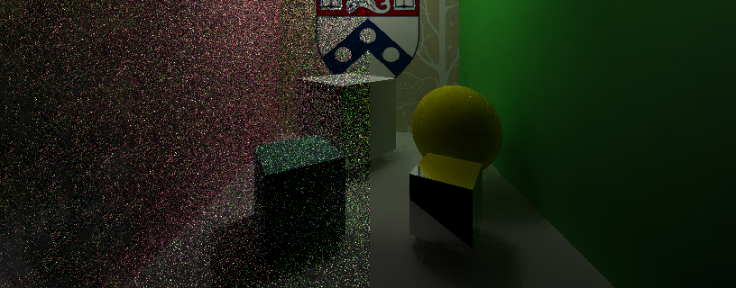

This is a CUDA-based path tracer capable of rendering globally-illuminated images very quickly.

## Features
### 1 Arbitrary Mesh Loading
The path tracer loads arbitrary mesh object from .obj files using [tinyObj](http://syoyo.github.io/tinyobjloader/). Loaded triangles and precomputed surface normals are stored in an addtional device buffer which can be quickly accessed.

| Bunny | Diamond | City |
|--|--|--|
|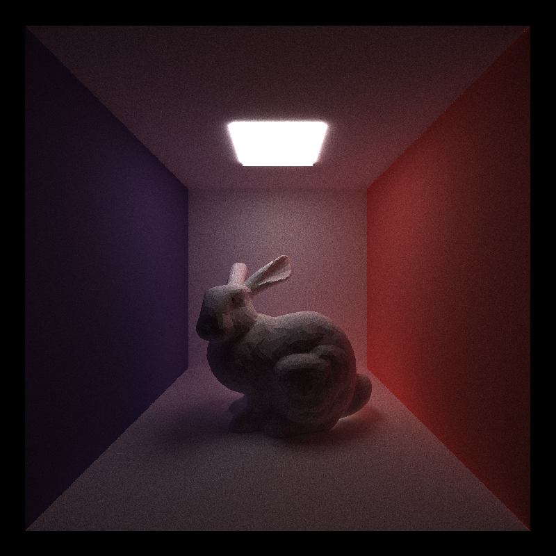 | 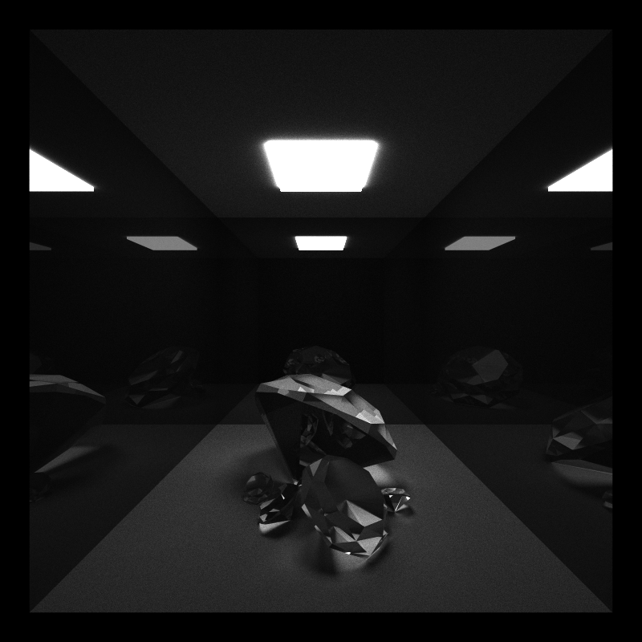 | 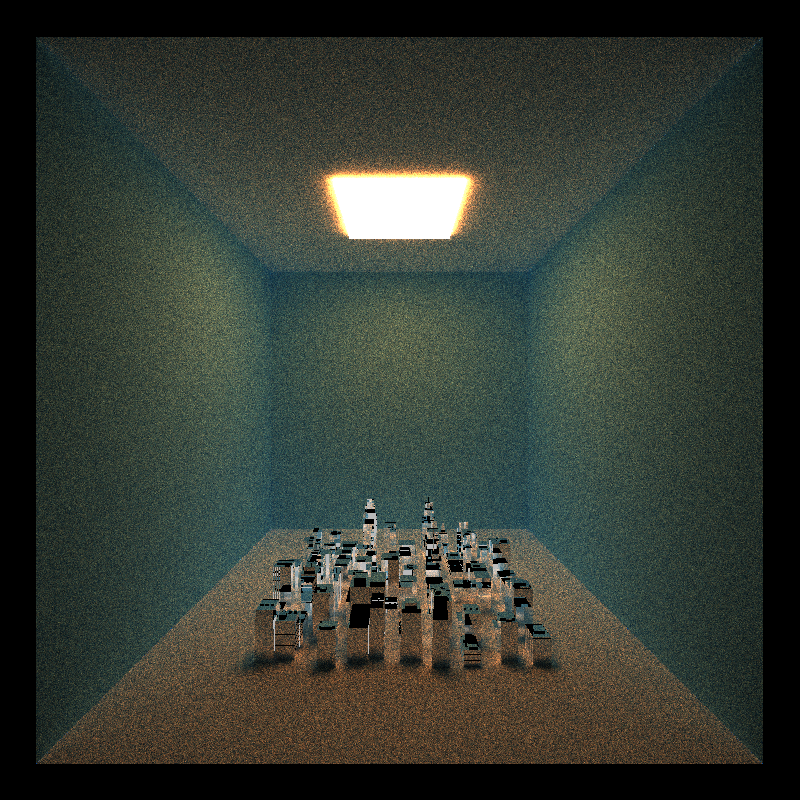 |

### 2 Refraction with Frensel Effects
Refraction with Frensel effects using Schlick's approximation.

| Perfect Speculer | Transmissive | Diffussive |
|--|--|--|
|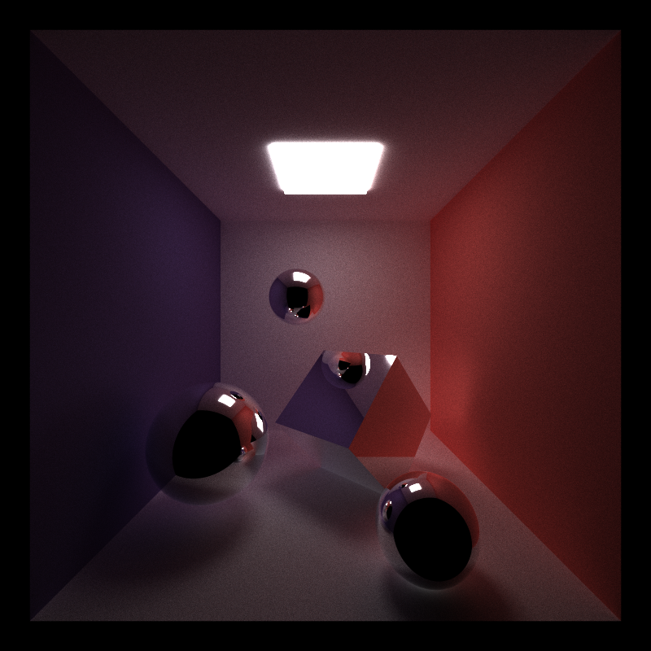 | 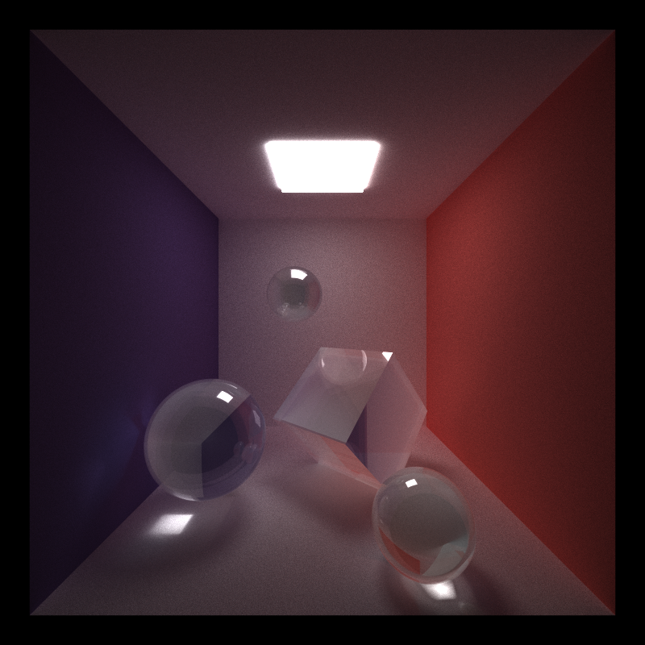 | 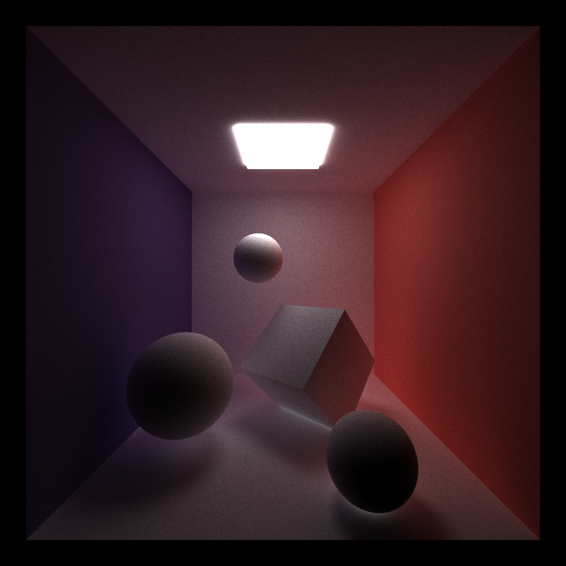 |

### 3 Physically-Based Depth-of-Field
Physically-based depth-of-field is achieved by simulating camera lens. Instead of using the pinhole camera model, we apply the thin lens approximation model. [PBRT 6.2.3]

The images below shows three renderings of one scene. The camera is focused at the frontmost sphere. Larger lens radius results in a deeper depth of field.

| DOF OFF | DOF ON (LR=0.5) | DOF ON (LR=2.0) |
|--|--|--|
|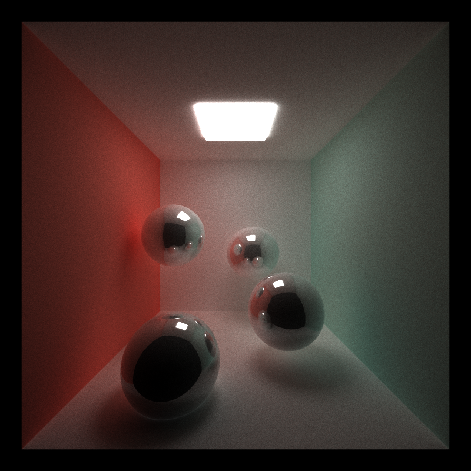 | 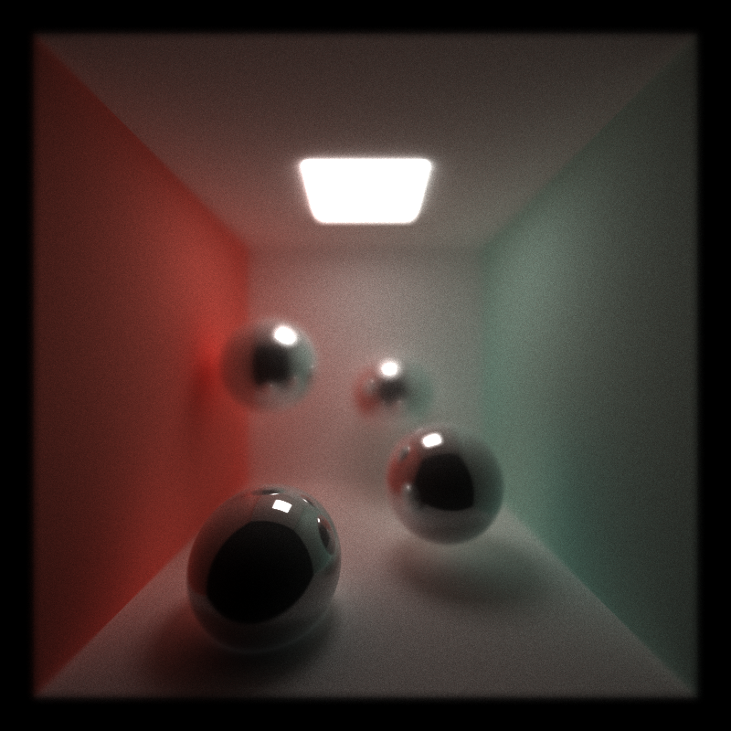 | 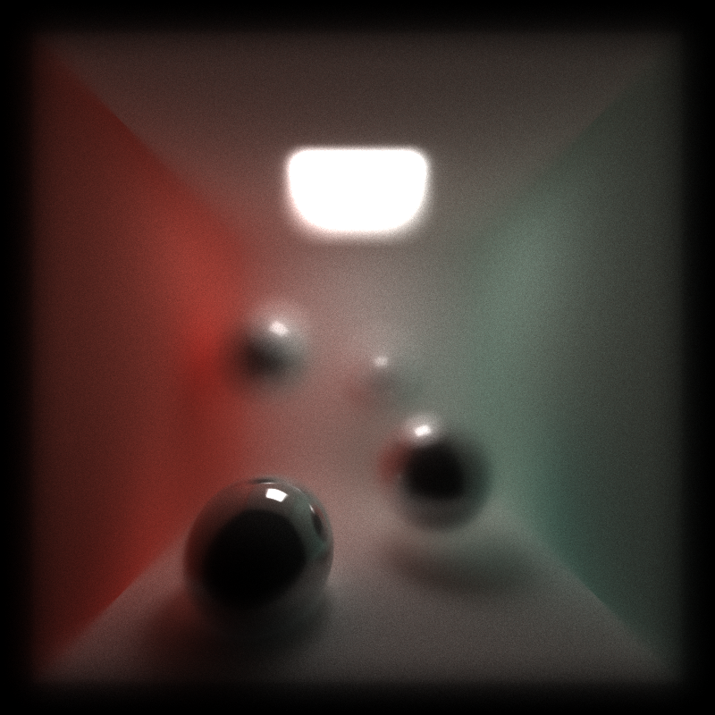 |

### 4 Stochastic Sampled Antialiasing
Anti-Aliasing is achieved by randomly jittering ray within the pixel and average the results of multiple rays.

| Antialiasing OFF | Antialiasing ON|
|--|--|
| | 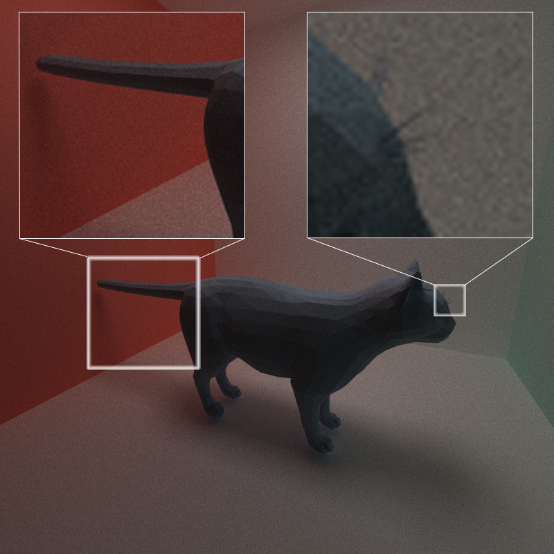 |

### 5 Camera Motion Blur
Camera motion blur is achieved by randomly jittering rays along the direction of motion.

| Static Camera | Rightward Motion | Forward Motion |
|--|--|--|
| | 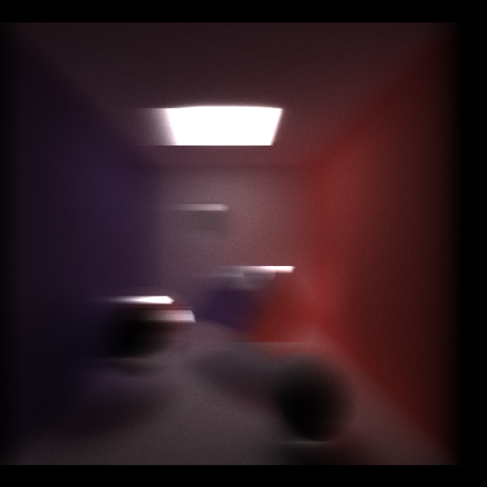 | 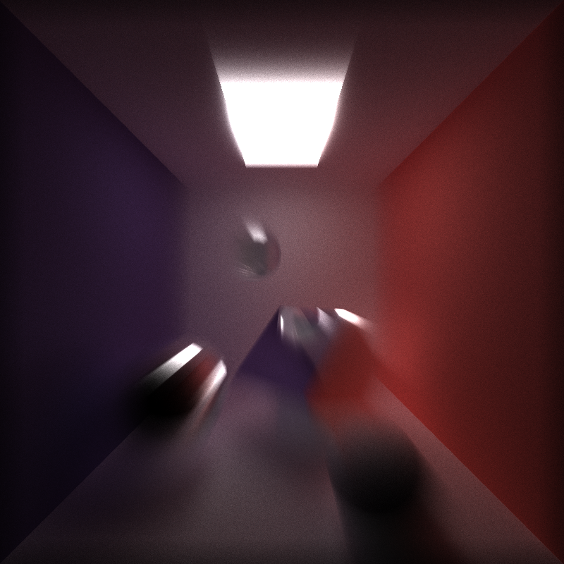 |

## Optimization
The following optimization methods are implemented to reduce rendering time:
 - **Stream Compaction:** Remove completed rays, reducing the number of threads to launch.
 - **Cache First Iteraction:** Cache the first bounce intersections for re-use across all subsequent iterations.
 - **Sort Materials:** Sort the rays/path segments so that rays/paths interacting with the same material are contiguous in memory before shading.
 - **Bounding Volume Intersection Culling:** Reduce the number of rays that have to be checked against the entire mesh by first checking rays against a volume that completely bounds the mesh. This optimization does not apply to primitive shapes.

We compare rendering performance with different optimization methods enabled.
 - NO = No Optimization
 - CF = Cache First iteration only
 - SC = Stream Compaction only
 - SM = Sort Materials only
 - IC = Bounding Volume Intersection Culling only
 - SC+IC+CF = Three optimizations combined
 - ALL = All Optimization

For a basic scene consists of a cornell box and four primitive shapes (spheres and boxes). Counterintuitively, the render time is minimized with no optimization. The probable cause is the kernel launch overhead for sorting and reduction.

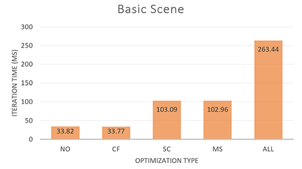

For a more complex scene consists of a cornell box and a Stanford bunny, optimizations reduce rendering time by almost 50%.

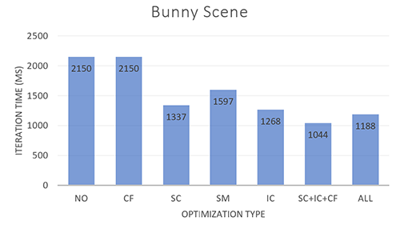

## Bloopers

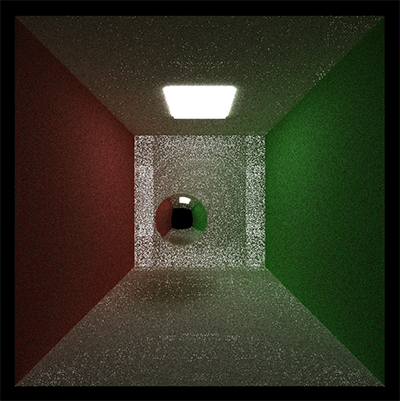

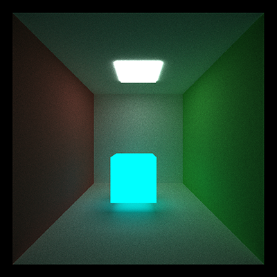

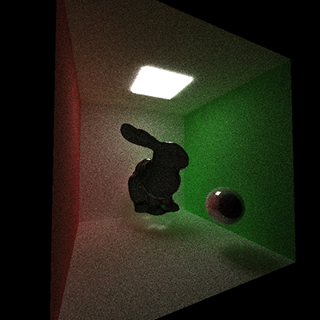

## Reference
 - Physically Based Rendering, Third Edition: From Theory To Implementation. Pharr, Matt and Humphreys, Greg.
 - Project 3 Recitation - Hannah ([link](https://docs.google.com/presentation/d/1bFtutDe9POZDPiqD9npeOEOWh783xHy4xf2AdJt-pEI/edit?usp=sharing))
 - Most Efficient AABB vs Ray Collision Algorithms. ([link](https://gamedev.stackexchange.com/questions/18436/most-efficient-aabb-vs-ray-collision-algorithms))
